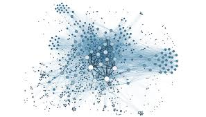
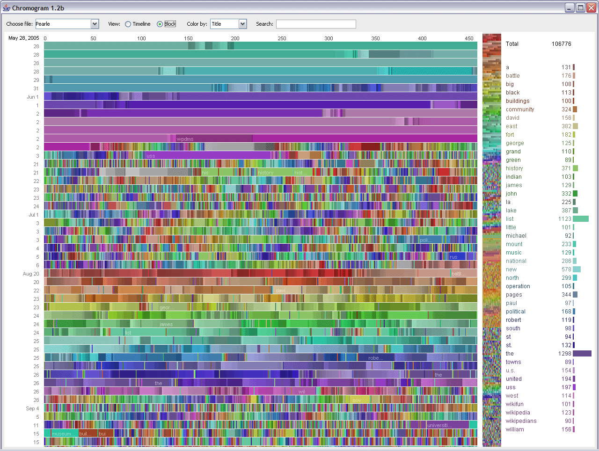
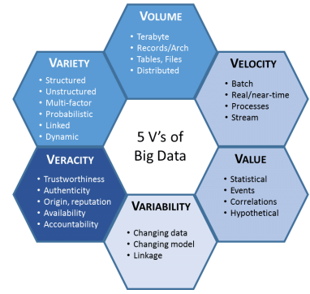
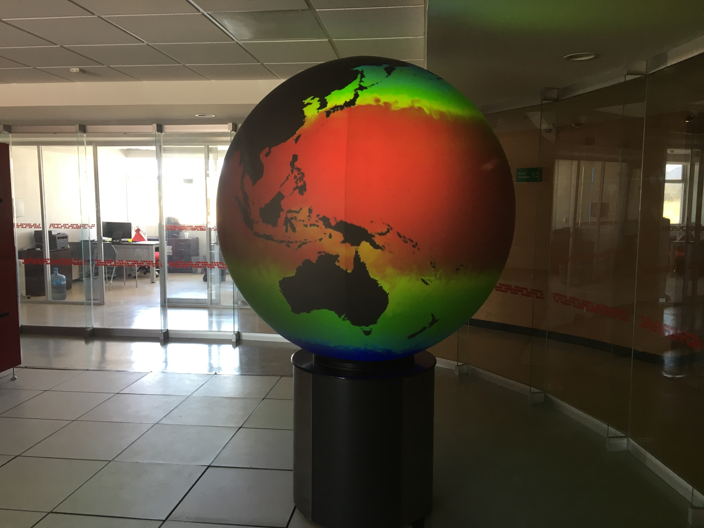

# Tecnologías Asociadas al IdC

## Datos masivos (Big Data)

Big Data, Macrodatos, datos masivos o a gran escala hace referencia a un gran conjunto de datos muy complejos que son tratados de manera especial para poder extraer información valiosa.

La cantidad de datos es tal que supera la capacidad del software convencional para ser capturados, administrados y procesados en un tiempo razonable. 

El término Big data lo hizo popular el Dr. En ciencias de la computación John Mashey

### Ejemplos de datos masivos y complejos

*   El universo digital mide approx 40 zettabytes, ( $4.72236648 \times 10^{22}$)

*   Historiales de navegación
*   Mapas multibanda georeferenciados. 
*   Datos recolectados por sensores en meteorología
*   Recopilación de datos de las personas en ámbitos turísticos, salud.
*   Recopilación de comportamiento de compras en internet (retail)
*   Registro de logs para detectar y reconocer fallas mas frecuentes en los sistemas informáticos.
*   Datos de colisión del LHC (Gran colisionador de hadrones)  (aproximadamente 25 petabytes)https://es.wikipedia.org/wiki/Gran_colisionador_de_hadrones
*   Open Street maps (800 Gb)

El volumen de datos en ciertas áreas, limita su análisis como en la genómica, análisis de redes (redes sociales, conectómica) meteorología.

La capacidad tecnológica per cápita a nivel mundial para almacenar datos se dobla aproximadamente cada cuarenta meses desde los [años 1980](https://es.wikipedia.org/wiki/Años_1980).[14](https://es.wikipedia.org/wiki/Macrodatos#cite_note-HilbertLopez20112-14)

Los sistemas de gestión de base de datos relacionales tienen dificultades tratando macrodatos con información estructurada y no estructurada de diversa naturaleza.

### Soluciones

*   Software de procesamiento masivamente paralelo MapReduce
*   Gestores de base de datos Not Only SQL
    *   

Big Data usa estadísticas inferenciales y conceptos de identificación de sistemas no lineales,[28](https://es.wikipedia.org/wiki/Macrodatos#cite_note-28) para inferir leyes (regresiones, relaciones no lineales y efectos causales) a partir de grandes conjuntos de datos con baja densidad de información, con la finalidad de revelar relaciones y dependencias, o para realizar predicciones de resultados y comportamientos.

**Ejemplo de estadística inferencial aplicada a la clasificación de uso de suelo.** Un modelo creado con el 10% de la información se puede inferir con cierta precisión el 90% restante 

 13.03.53.png)

Uno de los retos es la organización, adquisición y administración de estos datos.

### Captura de los datos

*   Generados por las propias personas en la web. 
*   Transacciones. 
*   Rastreo de la navegación por internet
*   Consultas en la web
*   Datos obtenidos a través de M2M *
*   Datos biométricos
*   Imágenes satelitales
*   Geografía: Datas georeferenciados 
*   

### Transformación

*   Se refiere a estandarizar los datos recogidos de diferentes fuentes con plataformas *Extract, Transform and Load*.
*   Es necesario para postprocesar los datos, limpiarlos, corregirlos etc...

### Almacenamiento

*   Se requiere un sistema de almacenamiento mucho mas flexible debido a la heterogeneidad de los datos. Se asume que los datos de diferentes fuentes pueden ser estructurados, semiestructurados o no estructurados, lo que dificulta el uso de base de datos relacionales. Una alternativa es el uso de bases de datos not Only SQL (NoSQL)

**Grupos de base de datos NoSQL**

Existen 4 grandes grupos:

1.  **Almacenamiento clave-valor**. 
    *   Los datos se almacenan en algo parecido a un diccionario de datos utilizando la tupla llave-valor. (llave única). 
    *   Los datos no necesariamente estan relacionados y se asume independencia Ejemplo CassandraDB. http://cassandra.apache.org/doc/latest/architecture/dynamo.html
    *   Son muy buenos realizando operaciones simples en base de datos muy grandes.  ejemplo: Como la consulta de un perfil de un usuario de algun servicio o recuperar datos que han sido calculados con anterioridad.

2.  **Basados en documentos:** 
    *   Soportan datos semiestructurados  y se pueden hacer consultas sobre ellos. 
    *   Los datos se llaman documentos y pueden tener formato XML, JSON, Binary JSON o algún otro. 
    *   Ejemplo CouchDB y MongoDB. 
3.  **Almacenamiento orientado a columna:**.
    *   Se parece al documental. 
    *   Es fácil escalar horizontalmente, gregando atributos y objetos nuevos a cada registro de info asociados a una clave. 
    *   Ejemplo Hyper Table, HBase.
4.  **Almacenamiento en grafo:**
    *   Basado en teoría de grafos, la información son representados con nodos y sus relaciones con aristas. Idóneo para analizar redes sociales. 
    *   Redes de citas. entre otros(Cypher, SPARQL, SPASQL)

### Análisis de datos

Para el análisis de datos se encuentran un gran colección de algoritmos provenientes de aprendizaje automático, como redes neuronales, máquinas soporte de vectores, algoritmos de agrupación entre otros. Estos algoritmos sirven para 

*   Encontrar asociaciones entre variables asumiendo causalidad (redes neuronales).
*   Minería de datos. (Búsqueda de patrones)
*   Agrupación (k-means).
*   Análisis de texto. (Técnicas de procesamiento de lenguaje natural. Expresiones regulares, n-gramas)

### Visualización de datos

*El mundo es complejo, dinámico, multidimensional, el papel es estático y plano. ¿Cómo vamos a representar la rica experiencia visual del mundo en la mera planicie?-Edward Tufte*, Profesor de evidencia estadística y diseño de información y de interfaces.

El primer reto es presentar datos complejos multidimensionales en grandes cantidades en un espacio bidimensional.

Ejemplo: Cromogram: un sistema de representación creado por [IBM](https://es.wikipedia.org/wiki/IBM) que muestra macrodatos que consisten en las ediciones de Wikipedia realizadas por el [bot](https://es.wikipedia.org/wiki/Bot) [Pearle](https://es.wikipedia.org/w/index.php?title=Pearle&action=edit&redlink=1). Su visualización más racional aparece acompañada de colores y posiciones en su representación.

Agrupación de datos multidimencionales con mapas auto-organizados

 13.32.05.png)

 13.31.51.png)

 13.31.59.png)

Que otros algorimos y plataformas existen?

### Aplicaciones de Big Data

1.  Industria

2.  Gobierno 

    1.  (https://www.inegi.org.mx/app/animotuitero/#/app/multiline)
    2.  https://u-gob.com/inegi-presenta-su-nueva-herramienta-de-big-data-para-medir-estado-de-animo-en-twitter/

3.  Empresas

4.  Desarrollo internacional

5.  Medios?

6.  Seguros

7.  Deportes

8.  Finanzas

9.  Marketing y ventas

    

    Investigación

10.  Medicina

11.  Muestreo. (como muestrear para Inferir por medio del estudio de un subconjunto de datos. Seleccion de datos para estimar características de la población completa)

12.  Defensa y seguridad. (proteccion de ciber ataques)

### Críticas a Big Data

Se hacen suposiciones muy fuertes sobre propiedades matemáticas que pueden no reflejar el comportamiento de los datos en la realidad. e.g., Asumir que los datos tienen una distrubución normal (gaussiana), son distribuidos uniformemente, cuando no lo son etc.).  (Snijders, Matzat y Reips). Supocisión de que correlación implica causalidad.

Mark Graham: Dice que los datos siempre deben contextualizarse en cada ámbito de estudio.

Ejemplo: si los datos consisten en series de tiempo lineales, caóticas. Imágenes. Información espacial, espacio temporal etc..., información geográfica.

Chris Anderson opina lo contrario. El análisis de big data será meramente empírico.

## Macrodatos (Big Data) e Internet de las cosas (IdC, IoT)

Se refiere en la adquisición de macro datos por medio de redes de comunicaciones y equipos de cómputo que comunican maquinas. (M2M).

*   El desarrollo de big data ha estado aislado de IdC en diferentes dominios. 
*   El mutuo entendimiento IdC -  MacroDatos data es importante para avanzar en la investigación y desarrollo de esta tecnología. Por lo tanto es importante revisar como Macrodatos se asocia con IdC.
*   Existen tecnologías clave para manejo de Macrodatos en diferentes dominios de IdC,  que pueden ser rehusados.

Ya que IdC conecta una gran variedad de dispositivos a través de internet, es importante el desarrollo de tecnología que soporte el desarrollo de estos dispositivos.

La implementación de aplicaciones de Internet de las cosas tiene algunos retos propios a resolvercomo el  recoger y analizar diferentes tipos de datos (heterogéneos) y en grandes cantidades del mundo real.

La extracción de información relevante de IdC puede ser utilizada para mejorar y enriquecer la vida diaria con aplicaciones orientadas a diferentes contextos.

==El contexto== es la información que es usada para caracterizar la situacion de entidades y esta siguracion es considerada ser relevante para la interacción en tiempo real.

==Una entidad== puede ser una persona, lugar, objeto.

Un contexto por lo regular tiene atributos o características de ubicación, tiempo, estado de las personas, environmental settings. 

Ejemplo: Pulso digital en ciudad de México https://www.alcaldesdemexico.com/notas-principales/pulso-digital-el-nuevo-proyecto-en-seguridad-de-la-cdmx/

IdC se convierte en una importante  plataforma que para funcionar requiere de estos datos contextuales en mucho volumen, variedad y velocidad, que hacen esta rama del big data retadora.

Big data tiene 5 características (+1) fundamentales:

1.  Volumen
2.  Velocidad
3.  Valor
4.  Variabilidad
5.  Veracidad
6.  Variedad. 

Para poder hacer estos datos utilizables se emplean:

-   [Aprendizaje automático](https://es.wikipedia.org/wiki/Aprendizaje_automático): los grandes datos a menudo no preguntan por qué y simplemente detectan los patrones[26](https://es.wikipedia.org/wiki/Macrodatos#cite_note-26)
-   [Huella digital](https://es.wikipedia.org/wiki/Huella_digital): el Big Data es a menudo un subproducto libre de costo de la interacción digital

En [6] sugiere otras caracteristicas como 

3.  viscosidad (latencia en la transmisión de datos)
4.  viralidad (velocidad de transmisión de los datos recibidos y enviados desde varias fuentes)
5.  visualizacion (interpretacion de datos e identificación de la info mas relevante.)

### Servicios que nacen de la Fusion de BigData - IdC

Propicia el desarrollo de servicios para muchos sistemas complejos como ciudades inteligentes.

Big Data ha abierto nuevas oportunidades de aplicación para industria y academia.

En el artículo se han revisado 117 articulos que aplican big data en 8 dominios según Bahga and Madisetti [65] 

1.  Salud
2.  Energía
3.  Transporte
4.  Edificios Inteligentes (building automation)
5.  Ciudades Inteligentes
6.  Agricultura
7.  Industria
8.  Milicia

La mayoría de los dominios necesitan **tecnología robusta** para lidiar con la disponibilidad de los objetos, seguridad especial para que los datos y la comunicación no sea vulnerada.[65, 66, 67, 68].

En áreas de la salud uno de los retos es reunir y analizar información médica en tiempo real para minimizar las limitaciones de los tratamientos médicos tradicionales. [11, 12]

Las plataformas en la nube son usadas para guardar y analizar flujo de datos medicos.

En energía, Big data se utiliza para algoritmos inteligentes de distribución de electricidad aprovechando los recursos renovables en sistemas eléctricos de potencia, control de la red de la distribución de energía.[16, 17]

Transporte:   Es una actividad clave. Ayuda en la planeación de rutas y desarrolla las aplicaciones para vigilancia, emergencia, control de tráfico, detección de anomalías, predicción de tráfico. Mimimización de contaminantes. 

Automatización de edificios: La integración de un gran número de dispositivos IdC en edificios , permiten monitoread todos los días actividades de los ciudadanos as como predecir su comportamiento. Esto se da al poder reunir información sensible a tiempo que describe de manera muy detallada interacciones entre humanos y máquinas [32,33,34]. 

Esta info es importante para optimizar servicios en edificios inteligentes, como seguridad, control de acceso, video digital, detección de intrusos, detección de fuego, servicios de ambientes internos o control de iluminación.

Ciudades Inteligentes: La visión de Ciudades inteligentes es mejorar el estilo de vida proveyendo mejoras en el servicio publico como, estacionamientos, limpieza de la ciuad, manejo de basura, iluminación en calles, control de emergencias  [35, 36, 37]. 

## Procesos de Big data y ciclo de vida 

**Propuesta de Gandomi: **

Gandomi 2015 [70] han dividido las etapas del tratamiento de big data en: 

1.  **Manejo de datos:** recolectar y guardar datos así como limpuar y recuperar datos para la preparación de su análisis. 
2.  **Analítica de datos**: Trata de la extracción de pistas de los datos. Contempla la modelización, análisis e interpretación.
    1.  Modelización , 
    2.  Análisis 
    3.  Interpretación.

**Propuesta de Paakkonen et al.** 2015 [72] 

Proponen una arquitectura de Big Data de referencia que enfocado a la fuente de datos y su almacenamiento como la entrada e infraestructura de los datos. 

**El proceso del tratamiento de los datos son 5 básicos**

1.  **Adquisición** de datos. (Datos recolectados por sensores)
2.  **Carga** de datos. (Cargar datos a memoria para ser analizados)
3.  **Preprocesamiento**. (Reparar datos.)
4.  **Procesamiento**. (Modelización)
5.  **Análisis**. (Análisis estadístico, visual)

**Propuesta de Khan et al. 2014 [71] **  

1.  **Recolección** de datos
2.  **Clasificación**
3.  **Análisis**
4.  **Recuperación** de datos para tomar decisiones.
5.  **Almacenamiento**
6.  **Difusión**

**Propuesta de Tsai et al 2015 [74]**

El proceso tiene dos fases

1.  **Fase de entrada**. 
    1.  Reunión de datos
    2.  Selección 
    3.  Transformación 
    4.  Analítica de datos. (reconocimiento de patrones, clustering)
2.  **Fase de salida:** 
    1.  Esta la aevaluación, e intepretacion de los datos así como su presentación.

## Big Data approaches in different IoT domains

Classification of big data approaches.

Table 2 

Storage: hbase(https://hbase.apache.org/), spark((https://spark.apache.org/), mongo db(https://www.mongodb.com/cloud/atlas/lp/try2?utm_source=google&utm_campaign=gs_americas_mexico_search_brand_atlas_desktop&utm_term=mongodb&utm_medium=cpc_paid_search&utm_ad=e&gclid=CjwKCAjw1v_0BRAkEiwALFkj5tkhS8JEsS31lPVIQgHZKolZR0uO8_hGO_KsdPxeJCLBiVxrn4bz4BoCqZkQAvD_BwE), mysql...

Cleaning: Anomaly detection, integrity, logical inference.

Analitics - Machine learning

Visualization : Visual exploration, datana lineage, visual analytics

## Comparación de  dominio en Idc desde la perspectiva de Macrodatos (Big Daa)

Almacenamiento: en todos los dominios, el almacenamiento en la nube es la infraestructura mas aceptada debido a que es escalable y elástica [194]. 

Ciudades inteligentes optan por almacenamiento en la nube, y una combinacion de manejadores de base de datos No SQL y base de datos relacionales.  (**CouchDB** [177] and **MongoDB** [177], **(Cassandra)**. 

Estas tecnologías permiten tener siempre los reportes actualizados.

Salud y agricultura: Utilizan aún base de datos relacionales.

En general  NoSQL es mas popular que las bases de datos relacionales en aplicaciones IOT

Limpieza: integraciónes considerado como prerequisitio para hacer analisis de datos.

Análisis:  **Hadoop** and **Spark**  se encuentra que se usan en la salud y transporte

**(Esto si es difícil). Métodos estadísticos para detectar y corregir outliers**

**Procesamiento big data**

 **MapReduce** es un metodo bien aceptado para hacer computo paralelo y recuperar datos de un almacenamiento distribuido a 

Extracción de patrones y árboles de decisión son populares en cuidado de la salud. y redes neuronales y reglas de asociacion son usados en energía.

Otros técnicas usadas en general 

*   semantic analysis
*   analytic hierarchy process
*   **clustering**
*   feature extraction
*   association rule mining, 
*   pattern recognition, 
*   decision Tree, 
*   neural network, 
*   Bayesian network,
*    frequent pattern mining, 
*   deep Learning, regression,
*    fuzzy logic, 
*   rule extraction, 
*   genetic algorithm, 
*   multiple linear regression, 
*   Naive Bayes, 
*   K-nearest neighbor algorithm, 
*   contextual filtering,
*    sequence analysis, and 
*   data envelopment analysis.

**Análisis de big data de enfoca en general en clasificar los datos**, buscar patrones y después producir predicciones. 

Visualización es llamado a veces interpretacion o presentación de datos.

No hay muchos métodos para lidiar con el procesamiento visual de datos en tiempo real.

Métodos de visualizacion prometen un futuro en el campo de la investigación de big data en IoT.

Ejemplo. Edificio del Laboratorio Nacional de visualización Avanzada  en la UNAM - Juriquilla

#### Tecnologías Claves infraestrucutra de

### Bibliografía 

M. Ge, H. Bangui, B. Buhnova, Big data for internet of things: A survey, *Future Generation Computer Systems* (2018), https://doi.org/10.1016/j.future.2018.04.053

Wikipedia, Macrodatos. https://es.wikipedia.org/wiki/Macrodatos

## Fog Computing

https://wattio.com/es/blog/que-es-el-fog-computing-/29

 

