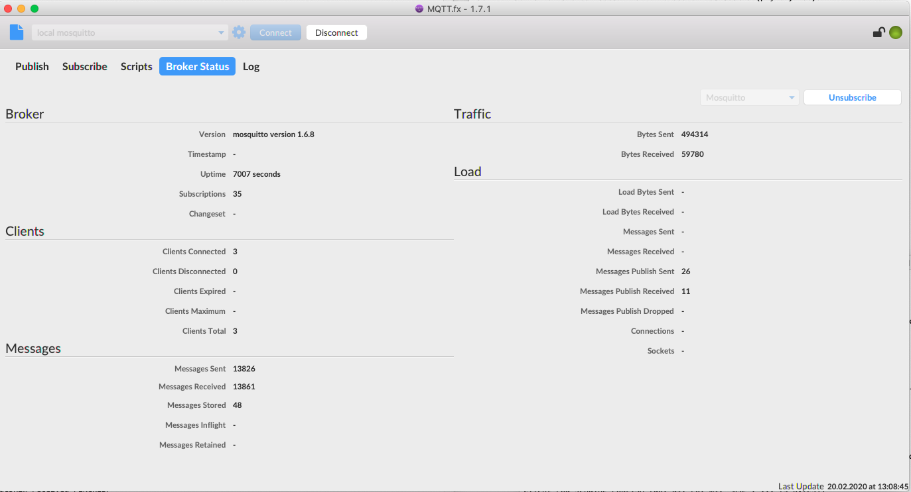
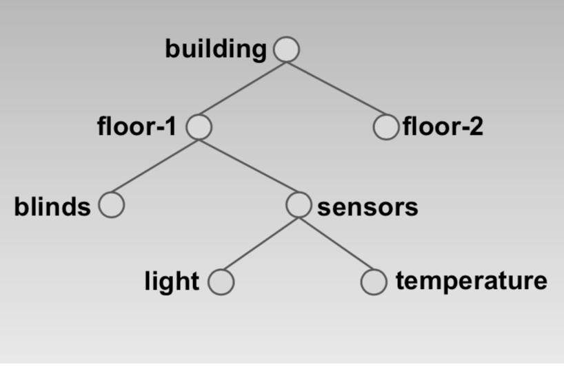
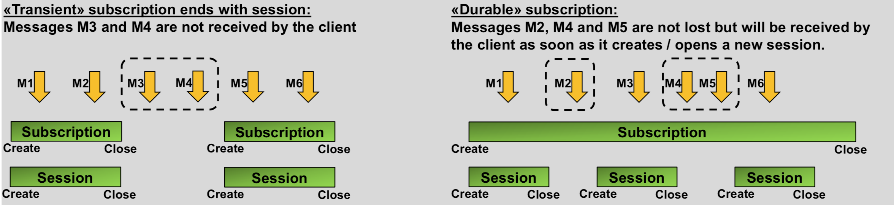
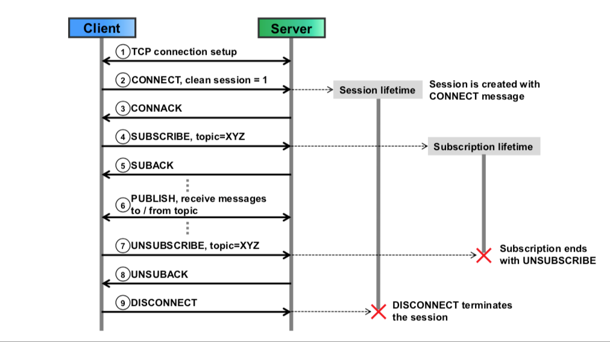
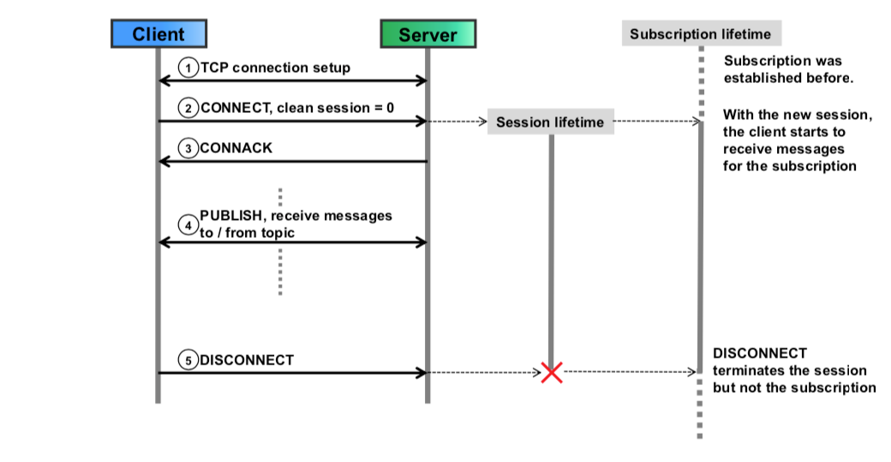
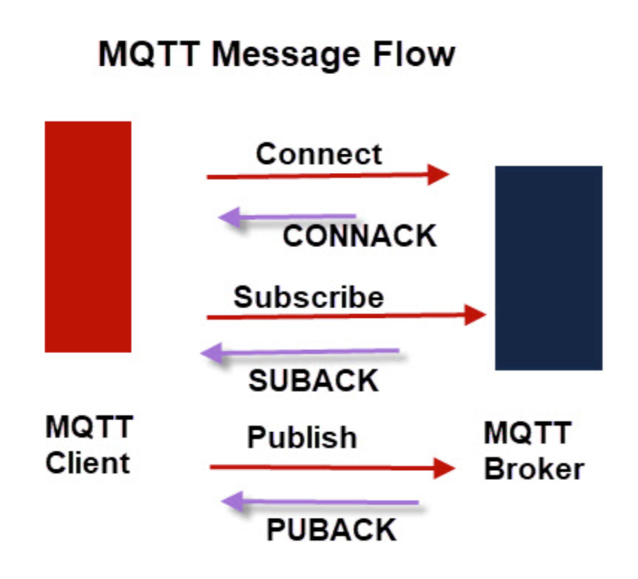
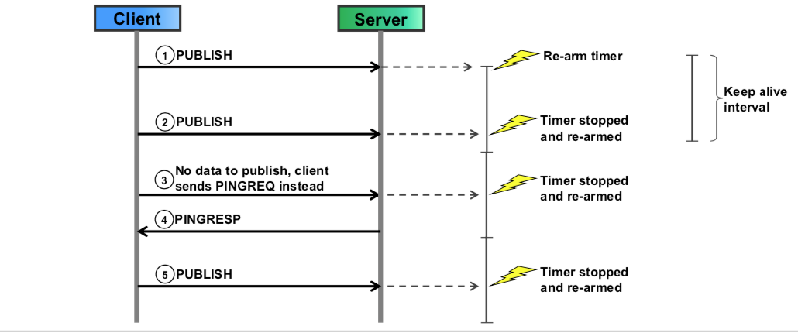
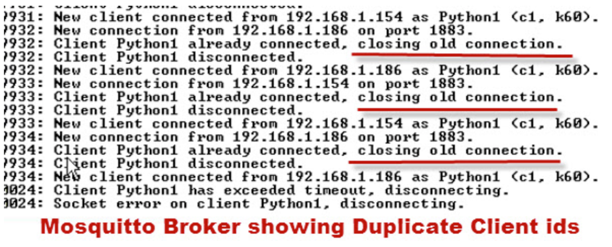
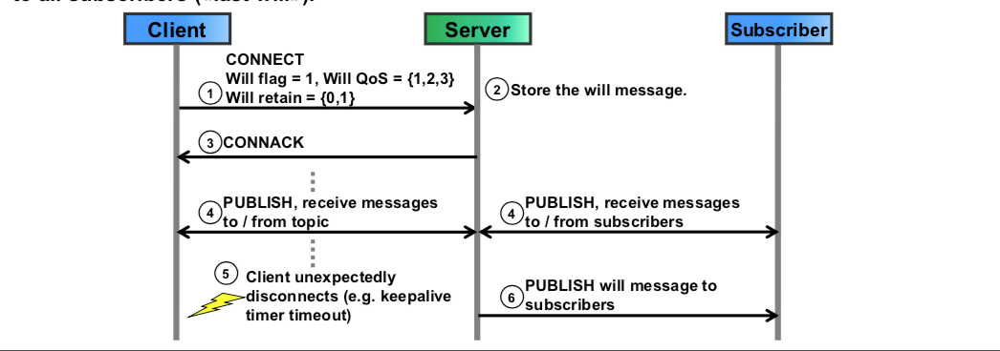

MQTT : Message Queue Telemetry Transport
========================================

 

 

Modelo MQTT
-----------

**Clientes**: Se comunican recibiendo y mandando mensajes por medio de
Suscripciones y Publicaciones etiquetadas por **Tópicos**.

**Servidor**: es el agente centralizado (**Broker**) que comunica a los
clientes.

 

**Tópicos** es la forma de direccionamiento que permiten a los clientes
compartir información entre ellos. Se estructuran en forma parecida al sistema
de archivos y carpetas. Los tópicos son:

1.  Sensibles a las mayúsculas

2.  Codificadas en UTF-8

3.  Deben tener un caracter para ser válidos.

 

 

**Tópico \$SYS:** es el único que puede ser creado por el broker y es de solo
lectura.

Contiene información propia de la implementación de MQTT, número de clientes,
clientes activos. etc...

Los clientes pueden suscribirse a un grupo de tópicos utilizando comodines
(*wildcard characters* \# (multi nivel) + (nivel simple)).

 

 

**Creación de tópicos**

 

Se crean cuando hay al menos un suscriptor y **retain=False**

 

**No hay suscriptores pero retain=True**.

 

Los tópicos se remueven cuando el último cliente asociado se desconecta.

Cuando un cliente se conecta con la bandera de limpiar sesión en verdadero.

 

**Sesión**:

Identifica la incorporación de un cliente al **broker**.

Es necesario para establecer la comunicación.

 

**Subscripción**:

Asocia un cliente a un tópico y pueden ser:

-   Pasajeras (*Transient*): Terminan junto con la sesión. Los mensajes
    pendientes no se entregan.

-   Durables: Sesión cerrada pero suscrición abierta. Se reciben los mensajes
    tan pronto y se reconecta el cliente.

 

El tipo de suscripción lo define una **bandera de sesión**.

 

 

### Estructura del Formato de mensajes

**Encabezado de dos bytes mínimo**

 

`Tipo de mensaje:                    4 bit`  
`bandera duplicado DUP:              1 bit`  
`Nivel de Calidad de servicio (QoS): 2 bit`  
`Bandera de retención (Retain):      1 bit`  
`longitud remanente                >=8 bit`  
`16 bit = 2 bytes`

### Longitud remanente.

Contiene el tamaño enseguida del encabezado mínimo que incluye:

-   El tamaño de encabezado variable

-   Carga util.

El byte 0 es el menos significativo.

 

### Formato de mensajes

1.  Connect - Connack. Broker acusa de recibido al cliente que la conexión es
    exitosa para publicar o suscribir.

2.  subscribe - suback

3.  publish - puback

 

 

Los clientes informan cada 60 segundos que siguen conectados con el mensaje
**keep alive**.

 

 

 

### Identificación de clientes MQTT.

Nombres de cliente son únicos. Si un cliente se intenta reconectar con el mismo
nombre, tumba al anterior que tratará de recuperarse y generarán un ciclo de
interrupciones causadas por al conexión-desconexión.

 

 

### Sesiones de clientes

Por defecto los clientes comienzan sesiones nuevas en los brokers, borrando toda
información asociada al cliente con anterioridad.

Si la sesión no es nueva, el broker recordara la sesión y puede entregar
mensajes no recibidos.

Se indica con la bandera de sesion.

 

### Mensajes de último deseo **Will message**.

Son mensajes especiales incluidos en **connect** que los suscriptiores reciben
en caso de que el publicador de caiga debido a problemas técnicos de red.

 

W**ill message** es asociado a cada tópico y es retenido por el **broker** quien
se encargará de difundirlo en dado caso.

Si el cliente publicador se desconecta normalmente, el **will message** por lo
regular no se envía.

Ejemplo proceso:

1.  El **publicador** se conecta al **broker** y le informa que quiere notificar
    su falla a todos los suscriptores.

2.  Si el broker detecta una ruptura de conexión (puede ser por medio del
    mensaje KTL (Keep to live).

 

### Esquema Publicador - Suscriptor

El esquema no permite dirigir mensajes a otros clientes con ID específicos.

El cliente publicador solo puede publicar un tópico a la vez. La relación es de
1:N a través de difusión de la información usando el tópico.

 

### Calidad de servicio y flujo de mensajes de mensajes publicados.

QoS 0, no se garantiza mensaje de envío. 0 \<= \#reenvío \<=1

QoS2 1, Se garantiza el mensaje con duplicados. 0 \<= \#reenvío

QoS2, Se garantiza el mensaje sin suplicados. \#reenvío = 1

 

 

 

### Mensajes publicados y bandera **Retain**

**Retain = false** : el broker no guarda el mensaje al ser enviado. Retain =
true: el broker guarda el último mensaje del publicador.

Uso: cuando los sensores no se actualizan frecuentemente.

 

### Referencias

 

Instalar paho

<http://www.steves-internet-guide.com/install-mosquitto-linux/>

 

pip —version

pip3 —version

 

pip install paho-mqtt (install in python version showed by pip)

pip3.4 install paho (install in python version showed pip3 —verision)

 

 

<http://www.steves-internet-guide.com/understanding-mqtt-qos-levels-part-1/>

<http://www.steves-internet-guide.com/understanding-mqtt-qos-2/>

Seguridad Lo veremos como parte de la unidad 4.4
------------------------------------------------
